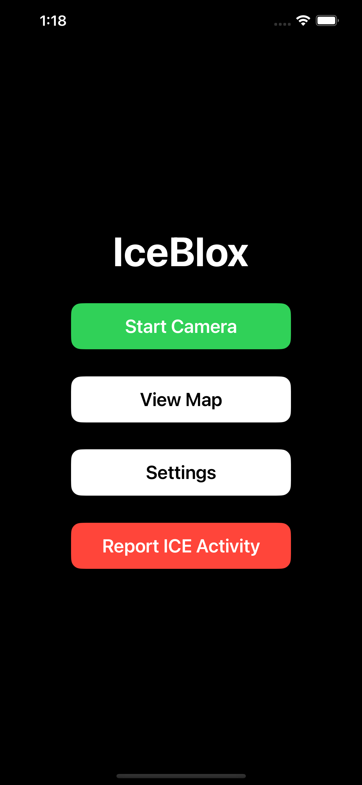
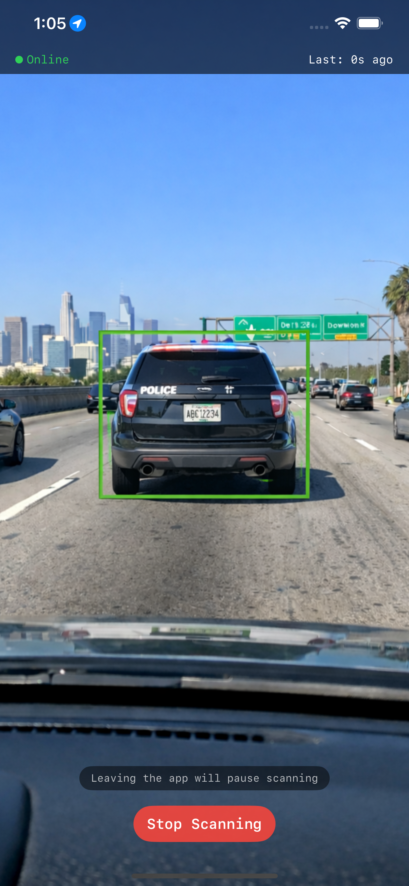
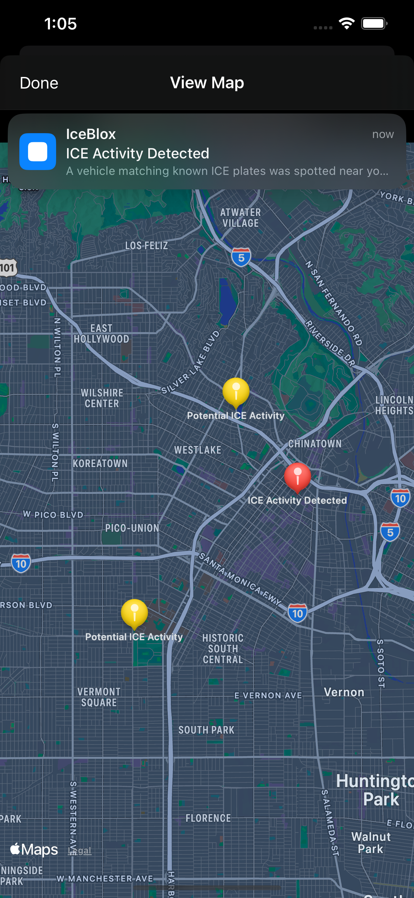
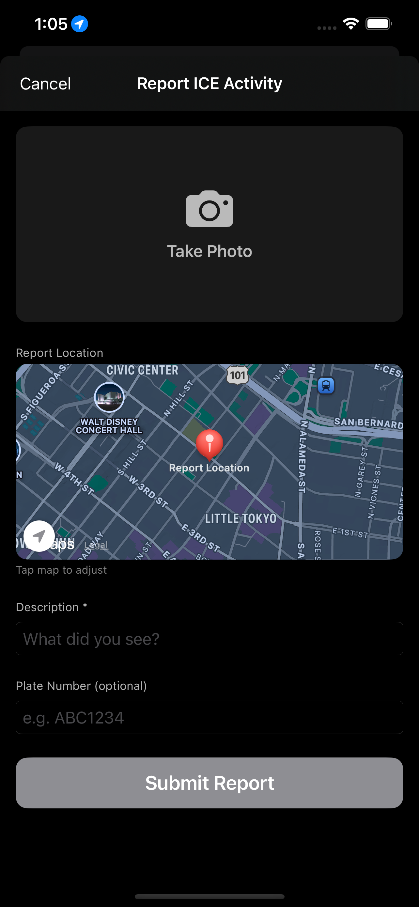

[](https://github.com/sudssm/iceblox/actions/workflows/test.yml) 

# IceBlox

A privacy-focused license plate detection system for community watch against ICE vehicles. A dashboard-mounted mobile app continuously scans for license plates, OCRs them on-device, and sends hashed plate identifiers to a server for comparison against a target list of known ICE vehicle plates from [StopICE](https://www.stopice.net/platetracker/?data=1).

The system is designed so that neither party learns what it shouldn't: the app never sees the target plates, and the server never sees non-target plates in plaintext.

<p align="center">
  
  
  
  
</p>

## How It Works

1. The mobile app captures camera frames and detects license plates on-device
2. Plate text is normalized and hashed (HMAC-SHA256) with a shared secret
3. Only the hash is sent to the server (or queued locally if offline)
4. The server compares the hash against pre-computed target hashes
5. Non-matching hashes are discarded from memory and never persisted

## Project Structure

```
├── android/          # Android app (Kotlin, Jetpack Compose)
├── ios/              # iOS app (Swift, SwiftUI)
├── models/           # YOLO model training and export
│   ├── Makefile      # setup, train, export, deploy
│   ├── training/     # Scripts, venv, dataset (gitignored)
│   └── exports/      # Exported .mlpackage / .tflite (gitignored)
├── server/           # Go server (plate matching, logging)
│   ├── Makefile      # setup, extract, run-server
│   └── data/         # Downloaded plate data (gitignored)
└── docs/             # Specifications and documentation
    ├── development-philosophy.md
    └── specs/
        ├── overview.md           # System architecture and privacy model
        ├── android/structure.md  # Android project layout and build commands
        ├── ios/structure.md      # iOS project layout and build commands
        ├── server/spec.md        # Server API spec
        └── mobile-app/           # Mobile app feature specs
```

## Tech Stack

| | Android | iOS |
|---|---|---|
| Language | Kotlin 2.1 | Swift 5.9+ |
| UI | Jetpack Compose, Material 3 | SwiftUI |
| Architecture | MVVM | MVVM |
| Min Version | API 28 (Android 9.0) | iOS 17.0 |
| Build System | Gradle (Kotlin DSL) | Xcode / Swift Package Manager |

## Quick Start

### Model Training

**Prerequisites:** Python 3.11+

The detection model is YOLOv8-nano fine-tuned on ~8,800 license plate images. All model commands run from the `models/` directory:

```bash
cd models

# Full pipeline: setup → download dataset → train → export → deploy to apps
make all

# Or run steps individually:
make setup            # Create Python venv, install dependencies
make download         # Download HuggingFace dataset (8,823 images)
make train            # Fine-tune YOLOv8-nano (~100 epochs, early stopping)
make validate         # Check quality gates (mAP≥0.80, P≥0.80, R≥0.75)
make export           # Export to Core ML (.mlpackage) and TFLite (.tflite)
make deploy           # Copy models to ios/ and android/ app directories

# Other useful targets:
make train-resume     # Resume training from last checkpoint
make evaluate         # Full evaluation with per-image stats and visuals
make detect IMAGES=path/to/image.jpg   # Run detection on images
make clean            # Remove training artifacts (keeps venv)
make help             # Show all targets
```

Training uses MPS (Apple Silicon GPU) automatically when available, falling back to CUDA or CPU. The model typically converges within 20-30 epochs with early stopping (patience=20).

### iOS

**Prerequisites:** Xcode 15+ with iOS 18 SDK

```bash
# Open in Xcode
open ios/IceBloxApp.xcodeproj

# Or build and run from the command line
xcodebuild -project ios/IceBloxApp.xcodeproj \
  -scheme IceBloxApp \
  -destination 'platform=iOS Simulator,name=iPhone 16 Pro' \
  build

# Install and launch on simulator
xcrun simctl boot "iPhone 16 Pro"
xcrun simctl install "iPhone 16 Pro" \
  Build/Products/Debug-iphonesimulator/IceBloxApp.app
xcrun simctl launch "iPhone 16 Pro" com.iceblox.app

# Run tests
xcodebuild -project ios/IceBloxApp.xcodeproj \
  -scheme IceBloxApp \
  -destination 'platform=iOS Simulator,name=iPhone 16 Pro' \
  test
```

### Server

**Prerequisites:** Go 1.26+, curl

```bash
cd server

# Download latest ICE plate data from StopICE
make setup

# Extract plates from XML into data/plates.txt
make extract

# Run schema migrations only
make migrate

# Run the server (loads plates, computes hashes, listens on :8080)
make run-server
```

Railway deployments run `make migrate` as a `preDeployCommand` before starting the new server instance.

### Android

**Prerequisites:** Android Studio or Android SDK with API 28+, JDK 11+

```bash
cd android

# Build debug APK
./gradlew assembleDebug

# Install on connected device/emulator
./gradlew installDebug

# Run tests
./gradlew test

# Run lint
./gradlew lint
```

## Documentation

See [`docs/`](docs/) for full specifications and architecture details:

- [System Overview](docs/specs/overview.md) — architecture, privacy model, data flow
- [Android Structure](docs/specs/android/structure.md) — project layout, dependencies, build commands
- [iOS Structure](docs/specs/ios/structure.md) — project layout, dependencies, build commands
- [Development Philosophy](docs/development-philosophy.md) — Spec-Driven Development methodology
